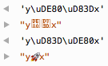

### 6. New string features

---

* 6.1. Overview
* 6.2. Unicode code point escapes
* 6.3. String interpolation, multi-line string literals and raw string literals
* 6.4. Iterating over strings
  * 6.4.1. Iteration honors Unicode code points
  * 6.4.2. Counting code points
  * 6.4.3. Reversing strings with non-BMP code points
* 6.5. Numeric values of code points
* 6.6. Checking for inclusion
* 6.7. Repeating strings
* 6.8. String methods that delegate regular expression work to their parameters
* 6.9. Reference: the new string methods

---

### 6.1 Overview

New string methods:

        > 'hello'.startsWith('hell')
        true
        > 'hello'.endsWith('ello')
        true
        > 'hello'.includes('ell')
        true
        > 'doo '.repeat(3)
        'doo doo doo '

新字符串方法 startsWith endsWith  includes repeat

ES6 has a new kind of string literal, the template literal:

ES6有一个字符串字面量 模板字面量

        // String interpolation via template literals (in backticks)
        const first = 'Jane';
        const last = 'Doe';
        console.log(`Hello ${first} ${last}!`);
        // Hello Jane Doe!

        // Template literals also let you create strings with multiple lines
        const multiLine = `
        This is
        a string
        with multiple
        lines`;

### 6.2 Unicode code point escapes

In ECMAScript 6, there is a new kind of Unicode escape that lets you specify any code point (even those beyond 16 bits):

ECMAScript 6有了新的Unicode的转义

        console.log('\u{1F680}');    // ES6: single code point
        console.log('\uD83D\uDE80'); // ES5: two code units

### 6.3 String interpolation, multi-line string literals and raw string literals

Template literals are described in depth in their own chapter. They provide three interesting features.

First, template literals support string interpolation:

模板字面量支持字符串插值

        const first = 'Jane';
        const last = 'Doe';
        console.log(`Hello ${first} ${last}!`);
            // Hello Jane Doe!

Second, template literals can contain multiple lines:

模板字面量支持多行

        const multiLine = `
        This is
        a string
        with multiple
        lines`;

Third, template literals are “raw” if you prefix them with the tag String.raw – the backslash is not a special character and escapes such as \n are not interpreted:

模板字面量用String.raw会转义

        const str = String.raw`Not a newline: \n`;
        console.log(str === 'Not a newline: \\n'); // true

### 6.4 Iterating over strings

Strings are iterable, which means that you can use for-of to iterate over their characters:

字符串是可遍历的 用for-of

        for (const ch of 'abc') {
            console.log(ch);
        }
        // Output:
        // a
        // b
        // c

And you can use the spread operator (...) to turn strings into Arrays:

字符串可以扩展操作符转为数组

        const chars = [...'abc'];
            // ['a', 'b', 'c']

### 6.4.1 Iteration honors Unicode code points
### 遍历Unicode code points

The string iterator splits strings along code point boundaries, which means that the strings it returns comprise one or two JavaScript characters:

            for (const ch of 'x\uD83D\uDE80y') {
                console.log(ch.length);
            }
            // Output:
            // 1
            // 2
            // 1

### 6.4.2 Counting code points

Iteration gives you a quick way to count the Unicode code points in a string:

字符串可以快速遍历Unicode编码

            > [...'x\uD83D\uDE80y'].length
            3

### 6.4.3 Reversing strings with non-BMP code points

Iteration also helps with reversing strings that contain non-BMP code points (which are larger than 16 bit and encoded as two JavaScript characters):

            const str = 'x\uD83D\uDE80y';

            // ES5: \uD83D\uDE80 are (incorrectly) reversed
            console.log(str.split('').reverse().join(''));
                // 'y\uDE80\uD83Dx'

            // ES6: order of \uD83D\uDE80 is preserved
            console.log([...str].reverse().join(''));
                // 'y\uD83D\uDE80x'

