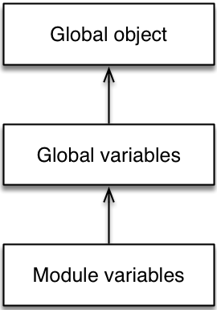

### 9. Variables and scoping

---

* 9.1. Overview
  * 9.1.1. let
  * 9.1.2. const
  * 9.1.3. Ways of declaring variables
* 9.2. Block scoping via let and const
* 9.3. const creates immutable variables
  * 9.3.1. Pitfall: const does not make the value immutable
  * 9.3.2. const in loop bodies
* 9.4. The temporal dead zone
  * 9.4.1. The life cycle of var-declared variables
  * 9.4.2. The life cycle of let-declared variables
  * 9.4.3. Examples
  * 9.4.4. typeof throws a ReferenceError for a variable in the TDZ
  * 9.4.5. Why is there a temporal dead zone?
  * 9.4.6. Further reading
* 9.5. let and const in loop heads
  * 9.5.1. for loop
  * 9.5.2. for-of loop and for-in loop
  * 9.5.3. Why are per-iteration bindings useful?
* 9.6. Parameters as variables
  * 9.6.1. Parameters versus local variables
  * 9.6.2. Parameter default values and the temporal dead zone
  * 9.6.3. Parameter default values don’t see the scope of the body
* 9.7. The global object
* 9.8. Function declarations and class declarations
* 9.9. Coding style: const versus let versus var
  * 9.9.1. An alternative approach

---

### 9.1 Overview

ES6 provides two new ways of declaring variables: let and const, which mostly replace the ES5 way of declaring variables, var.

ES6 用let const来替换var

### 9.1.1 let

let works similarly to var, but the variable it declares is block-scoped, it only exists within the current block. var is function-scoped.

let与var类似 区别在于let是块级作用域 与let最近块 var是函数作用域

In the following code, you can see that the let-declared variable tmp only exists inside the block that starts in line A:

          function order(x, y) {
              if (x > y) { // (A)
                  let tmp = x;
                  x = y;
                  y = tmp;
              }
              console.log(tmp===x); // ReferenceError: tmp is not defined
              return [x, y];
          }

### 9.1.2 const

const works like let, but the variable you declare must be immediately initialized, with a value that can’t be changed afterwards.

const与let类似 但是const声明的必须立即初始化 并且值不能修改

          const foo;
              // SyntaxError: missing = in const declaration

          const bar = 123;
          bar = 456;
          // TypeError: `bar` is read-only

Since for-of creates one binding (storage space for a variable) per loop iteration, it is OK to const-declare the loop variable:

由于for-of每一次循环迭代都会创建一个存储空间与变量进行绑定所以可以const声明

          for (const x of ['a', 'b']) {
              console.log(x);
          }
          // Output:
          // a
          // b

### 9.1.3 Ways of declaring variables

The following table gives an overview of six ways in which variables can be declared in ES6 ([inspired by a table by kangax](https://twitter.com/kangax/status/567330097603284992)):

| Header One     | Hoisting 预解析     |Scope 作用域    |Creates global properties 是否是全局属性     |
| :------------- | :------------- |:------------- |:-------------: |
| var      | Declaration          | Function      | Yes       |
| let      | Temporal dead zone   | Block         | No       |
| const    | Temporal dead zone   | Block         | No       |
| function | Complete             | Block         | Yes       |
| class    | No                   | Block         | No       |
| import   | Complete             | Module-global | No       |

总结：

var function 会预解析 let const class import 不会预解析

function let const class import 块级作用域 var 不是

var function 会产生全局属性 所以少用 只有在最外层才是

### 9.2 Block scoping via let and const

Both let and const create variables that are block-scoped – they only exist within the innermost block that surrounds them. The following code demonstrates that the const-declared variable tmp only exists inside the block of the if statement:

let const 仅作用于最近的{}

        function func() {
            if (true) {
                const tmp = 123;
            }
            console.log(tmp); // ReferenceError: tmp is not defined
        }

In contrast, var-declared variables are function-scoped:

        function func() {
            if (true) {
                var tmp = 123;
            }
            console.log(tmp); // 123
        }

Block scoping means that you can shadow variables within a function:

        function func() {
          const foo = 5;
          if (···) {
             const foo = 10; // shadows outer `foo`
             console.log(foo); // 10
          }
          console.log(foo); // 5
        }

### 9.3 const creates immutable variables

Variables created by let are mutable:

        let foo = 'abc';
        foo = 'def';
        console.log(foo); // def

Constants, variables created by const, are immutable – you can’t assign different values to them:

        const foo = 'abc';
        foo = 'def'; // TypeError

**Spec detail: changing a const variable always throws a TypeError**

Normally, changing an immutable binding only causes an exception in strict mode, as per [SetMutableBinding()](http://www.ecma-international.org/ecma-262/6.0/#sec-declarative-environment-records-setmutablebinding-n-v-s). But const-declared variables always produce strict bindings – see [FunctionDeclarationInstantiation(func, argumentsList)](http://www.ecma-international.org/ecma-262/6.0/#sec-functiondeclarationinstantiation), step 35.b.i.1.

### 9.3.1 Pitfall: const does not make the value immutable
### 易犯错误 const的值不可改变

const only means that a variable always has the same value, but it does not mean that the value itself is or becomes immutable.

const只是变量有相同值 但并不意味着值自己不可变

const不可变就是变量的内存地址不可变 但是内存地址中内容是可变的

For example, obj is a constant, but the value it points to is mutable – we can add a property to it:

        const obj = {};
        obj.prop = 123;
        console.log(obj.prop); // 123

We cannot, however, assign a different value to obj:

        obj = {}; // TypeError

If you want the value of obj to be immutable, you have to take care of it, yourself. For example, by freezing it:

如果不想给const声明的变量添加属性进行改变可以Object.freeze 进行冻结

        const obj = Object.freeze({});
        obj.prop = 123; // TypeError

### 9.3.1.1 Pitfall: Object.freeze() is shallow
### 易犯错误 Object.freeze() is shallow

Keep in mind that Object.freeze() is shallow, it only freezes the properties of its argument, not the objects stored in its properties.

For example, the object obj is frozen:

        > const obj = Object.freeze({ foo: {} });
        > obj.bar = 123
        TypeError: Can't add property bar, object is not extensible

        > obj.foo = {}
        TypeError: Cannot assign to read only property 'foo' of #<Object>

But the object obj.foo is not.

        > obj.foo.qux = 'abc';
        > obj.foo.qux
        'abc'

### 9.3.2 const in loop bodies

Once a const variable has been created, it can’t be changed. But that doesn’t mean that you can’t re-enter its scope and start fresh, with a new value.

一旦const变量已经被创建 是不能被改变 但是并不意味着 你不可以再进入它的作用域和用一个新值重新刷新

For example, via a loop:

        function logArgs(...args) {
            for (const [index, elem] of args.entries()) { // (A)
                const message = index + '. ' + elem; // (B)
                console.log(message);
            }
        }
        logArgs('Hello', 'everyone');

        // Output:
        // 0. Hello
        // 1. everyone

There are two const declarations in this code, in line A and in line B. And during each loop iteration, their constants have different values.

### 9.4 The temporal dead zone

A variable declared by let or const has a so-called temporal dead zone (TDZ): When entering its scope, it can’t be accessed (got or set) until execution reaches the declaration. Let’s compare the life cycles of var-declared variables (which don’t have TDZs) and let-declared variables (which have TDZs).

用let const声明的变量有一个被叫temporal dead zone (TDZ) 当进入变量的作用域 一直到这个变量的声明被执行 才能对变量进行set get的操作

var 没有 temporal dead zone (TDZ) let 有temporal dead zone (TDZ)

### 9.4.1 The life cycle of var-declared variables
### var声明变量生命周期

var variables don’t have temporal dead zones. Their life cycle comprises the following steps:

var声明变量没有TDZ 它们周期有下面步骤:

* When the scope (its surrounding function) of a var variable is entered, storage space (a binding) is created for it. The variable is immediately initialized, by setting it to undefined.

* 当进入函数作用域 一个存储空间被创建 这个变量立即被初始化用undefined

* When the execution within the scope reaches the declaration, the variable is set to the value specified by the initializer (an assignment) – if there is one. If there isn’t, the value of the variable remains undefined.

* 当声明语句被执行的首 变量被赋予新值 如果没有新值依然是undefined

### 9.4.2 The life cycle of let-declared variables
### let声明变量声明周期

Variables declared via let have temporal dead zones and their life cycle looks like this:

let声明的变量有TDZ 变量生命周期如下:

* When the scope (its surrounding block) of a let variable is entered, storage space (a binding) is created for it. The variable remains uninitialized.

* 当变量作用域 一个存储空间被创建 但是不会初始化

* Getting or setting an uninitialized variable causes a ReferenceError.

* 这个时候任何设置或获取的动作都会引起TypeError

* When the execution within the scope reaches the declaration, the variable is set to the value specified by the initializer (an assignment) – if there is one. If there isn’t then the value of the variable is set to undefined.

* 声明的语句被执行 这时候就完成初始化无论有没有具体值  如果没有值也是undefinded

const variables work similarly to let variables, but they must have an initializer (i.e., be set to a value immediately) and can’t be changed.

const声明和let类似 区别在于const必须用值进行初始化 并且不能改变

### 9.4.3 Examples

Within a TDZ, an exception is thrown if a variable is got or set:

在TDZ区域 会引起ReferenceError

        let tmp = true;
        if (true) { // enter new scope, TDZ starts
            // Uninitialized binding for `tmp` is created
            console.log(tmp); // ReferenceError

            let tmp; // TDZ ends, `tmp` is initialized with `undefined`
            console.log(tmp); // undefined

            tmp = 123;
            console.log(tmp); // 123
        }
        console.log(tmp); // true

If there is an initializer then the TDZ ends after the initializer was evaluated and the result was assigned to the variable:

        let foo = console.log(foo); // ReferenceError

The following code demonstrates that the dead zone is really temporal (based on time) and not spatial (based on location):

        if (true) { // enter new scope, TDZ starts
            const func = function () {
                console.log(myVar); // OK!
            };

            // Here we are within the TDZ and
            // accessing `myVar` would cause a `ReferenceError`

            let myVar = 3; // TDZ ends
            func(); // called outside TDZ
        }

### 9.4.4 typeof throws a ReferenceError for a variable in the TDZ

If you access a variable in the temporal dead zone via typeof, you get an exception:

        if (true) {
            console.log(typeof foo); // ReferenceError (TDZ)
            console.log(typeof aVariableThatDoesntExist); // 'undefined'
            let foo;
        }

Why? The rationale is as follows: foo is not undeclared, it is uninitialized. You should be aware of its existence, but aren’t. Therefore, being warned seems desirable.

Furthermore, this kind of check is only useful for conditionally creating global variables. That is something that you don’t need to do in normal programs.

### 9.4.4.1 Conditionally creating variables

When it comes to conditionally creating variables, you have two options.

* Option 1 – typeof and var:

        if (typeof someGlobal === 'undefined') {
            var someGlobal = { ··· };
        }

This option only works in global scope (and therefore not inside ES6 modules).

* Option 2 – window:

      if (!('someGlobal' in window)) {
          window.someGlobal = { ··· };
      }

### 9.4.5 Why is there a temporal dead zone?

*There are several reasons why const and let have temporal dead zones:

* To catch programming errors: Being able to access a variable before its declaration is strange. If you do so, it is normally by accident and you should be warned about it.

* For const: Making const work properly is difficult. [Quoting Allen Wirfs-Brock: “TDZs … ](https://mail.mozilla.org/pipermail/es-discuss/2012-September/024996.html)provide a rational semantics for const. There was significant technical discussion of that topic and TDZs emerged as the best solution.” let also has a temporal dead zone so that switching between let and const doesn’t change behavior in unexpected ways.

* Future-proofing for guards: JavaScript may eventually have guards, a mechanism for enforcing at runtime that a variable has the correct value (think runtime type check). If the value of a variable is undefined before its declaration then that value may be in conflict with the guarantee given by its guard.

### 9.4.6 Further reading

Sources of this section:

* [“Performance concern with let/const”](https://esdiscuss.org/topic/performance-concern-with-let-const)
* [“Bug 3009 – typeof on TDZ variable”](https://bugs.ecmascript.org/show_bug.cgi?id=3009)

### 9.5 let and const in loop heads

The following loops allow you to declare variables in their heads:

* for
* for-in
* for-of

To make a declaration, you can use either var, let or const. Each of them has a different effect, as I’ll explain next.

### 9.5.1 for loop

var-declaring a variable in the head of a for loop creates a single binding (storage space) for that variable:

        const arr = [];
        for (var i=0; i < 3; i++) {
            arr.push(() => i);
        }
        arr.map(x => x()); // [3,3,3]

Every i in the bodies of the three arrow functions refers to the same binding, which is why they all return the same value.

所有循环中var声明只有一个存储空间

If you let-declare a variable, a new binding is created for each loop iteration:

用let声明变量 每一个循环一次就生成一个新绑定 一个新空间

        const arr = [];
        for (let i=0; i < 3; i++) {
            arr.push(() => i);
        }
        arr.map(x => x()); // [0,1,2]

This time, each i refers to the binding of one specific iteration and preserves the value that was current at that time. Therefore, each arrow function returns a different value.

const works like var, but you can’t change the initial value of a const-declared variable:

const与var类似 但const不能改变初始值

        // TypeError: Assignment to constant variable
        // (due to i++)
        for (const i=0; i<3; i++) {
            console.log(i);
        }

Getting a fresh binding for each iteration may seem strange at first, but it is very useful whenever you use loops to create functions that refer to loop variables, as explained in a later section.

**for loop: per-iteration bindings in the spec **
[The evaluation of the for loop](http://www.ecma-international.org/ecma-262/6.0/#sec-for-statement-runtime-semantics-labelledevaluation) handles var as the second case and let/const as the third case. Only let-declared variables are added to the list perIterationLets (step 9), which is passed to [ForBodyEvaluation()](http://www.ecma-international.org/ecma-262/6.0/#sec-forbodyevaluation) as the second-to-last parameter, perIterationBindings.

### 9.5.2 for-of loop and for-in loop

In a for-of loop, var creates a single binding:

在for-of循环中 var也创建单个绑定

        const arr = [];
        for (var i of [0, 1, 2]) {
            arr.push(() => i);
        }
        arr.map(x => x()); // [2,2,2]

const creates one immutable binding per iteration:

const也创建一个可变绑定在每一次迭代

        const arr = [];
        for (const i of [0, 1, 2]) {
            arr.push(() => i);
        }
        arr.map(x => x()); // [0,1,2]

let also creates one binding per iteration, but the bindings it creates are mutable.

而let创建单个绑定每次迭代中 但是这个绑定是不可变

The for-in loop works similarly to the for-of loop.

for-in与for-of循环相似

总结
for循环中 var const 只创建一个存储空间  const的值不能改变 let每次迭代中都创建一个新存储空间

for-of for-in循环中 var 创建单个绑定  let const每次迭代创建一个新的存储空间 const的绑定不可改变的 let是可变的

### 9.5.3 Why are per-iteration bindings useful?

The following is an HTML page that displays three links:

* If you click on “yes”, it is translated to “ja”.
* If you click on “no”, it is translated to “nein”.
* If you click on “perhaps”, it is translated to “vielleicht”.

        <!doctype html>
        <html>
        <head>
            <meta charset="UTF-8">
        </head>
        <body>
            

            
        </body>
        </html>

What is displayed depends on the variable target (line B). If we had used var instead of const in line A, there would be a single binding for the whole loop and target would have the value 'vielleicht', afterwards. Therefore, no matter what link you click on, you would always get the translation 'vielleicht'.

Thankfully, with const, we get one binding per loop iteration and the translations are displayed correctly.

### 9.6 Parameters as variables
### 参数和变量

### 9.6.1 Parameters versus local variables
### 参数与本地变量

If you let-declare a variable that has the same name as a parameter, you get a static (load-time) error:

不用let声明一个本地变量与参数同名 会报错

        function func(arg) {
            let arg; // static error: duplicate declaration of `arg`
        }

Doing the same inside a block shadows the parameter:

        function func(arg) {
            {
                let arg; // shadows parameter `arg`
            }
        }

In contrast, var-declaring a variable that has the same name as a parameter does nothing, just like re-declaring a var variable within the same scope does nothing.

用var声明一个变量与参数相同

        function func(arg) {
            var arg; // does nothing
        }
        function func(arg) {
            {
                // We are still in same `var` scope as `arg`
                var arg; // does nothing
            }
        }

### 9.6.2 Parameter default values and the temporal dead zone
### 参数默认值和TDZ

If parameters have default values, they are treated like a sequence of let statements and are subject to temporal dead zones:

如果参数有默认值 他们被认为执行一些语句 并且遵循TDZ

        // OK: `y` accesses `x` after it has been declared

        function foo(x=1, y=x) {
            return [x, y];
        }
        foo(); // [1,1]

        // Exception: `x` tries to access `y` within TDZ

        function bar(x=y, y=2) {
            return [x, y];
        }
        bar(); // ReferenceError

### 9.6.3 Parameter default values don’t see the scope of the body
### 参数默认值不进入函数作用域

The scope of parameter default values is separate from the scope of the body (the former surrounds the latter). That means that methods or functions defined “inside” parameter default values don’t see the local variables of the body:

参数默认值的作用域与函数本身作用域是分开的 参数默认值的作用域不能进入函数本身作用域

        const foo = 'outer';

        function bar(func = x => foo) {
            const foo = 'inner';
            console.log(func()); // outer
        }

        bar();

### 9.7 The global object

JavaScript’s global object (window in web browsers, global in Node.js) is more a bug than a feature, especially with regard to performance. That’s why it makes sense that ES6 introduces a distinction:

Javascript全局对象(客户端 window Nodejs global)是一个bug比特色在考虑性能。认清ES6并介绍特色

* All properties of the global object are global variables. In global scope, the following declarations create such properties:

* 全局对象属性是全局变量 在全局作用域 下面声明就如创建一个属性

  * var declarations  var声明
  * Function declarations function声明

* But there are now also global variables that are not properties of the global object. In global scope, the following declarations create such variables:

* 下面声明在全局作用域就不会成为全局的属性

  * let declarations      let声明
  * const declarations    const声明
  * Class declarations    类声明

Note that the bodies of modules are not executed in global scope, only scripts are. Therefore, the environments for various variables form the following chain.

模块的代码不在全局作用域里面执行 仅仅是script方式 因而作用域链如下:

### 9.8 Function declarations and class declarations
### 函数与类的声明

**Function declarations… 函数声明**

* are block-scoped, like let.

  是块级作用域 与let类似

* create properties in the global object (while in global scope), like var.

  在给全局对象创建一个属性 与var类似

* are hoisted: independently of where a function declaration is mentioned in its scope, it is always created at the beginning of the scope.

  预解析:函数声明独立在作用域发生 并且作用域最开始

The following code demonstrates the hoisting of function declarations:

{ // Enter a new scope

    console.log(foo()); // OK, due to hoisting
    function foo() {
        return 'hello';
    }
}

**Class declarations…类声明**

* are block-scoped.

  也是块级作用域

* don’t create properties on the global object.

  不会给全局对象创建属性

* are not hoisted.

  不会预解析

Classes not being hoisted may be surprising, because, under the hood, they create functions. The rationale for this behavior is that the values of their extends clauses are defined via expressions and those expressions have to be executed at the appropriate times.

类不预解析不是惊奇 因为为了extends恰当执行时机 因为extends可能继承是一个函数表达式 而函数表达式不会预解析

{ // Enter a new scope

    const identity = x => x;

    // Here we are in the temporal dead zone of `MyClass`
    const inst = new MyClass(); // ReferenceError

    // Note the expression in the `extends` clause
    class MyClass extends identity(Object) {
    }
}
