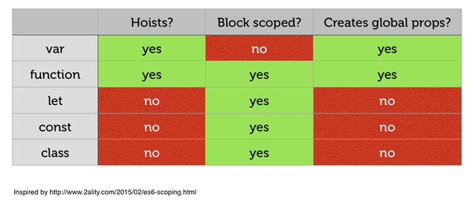

### 9. Variables and scoping

---

* 9.1. Overview
  * 9.1.1. let
  * 9.1.2. const
  * 9.1.3. Ways of declaring variables
* 9.2. Block scoping via let and const
* 9.3. const creates immutable variables
  * 9.3.1. Pitfall: const does not make the value immutable
  * 9.3.2. const in loop bodies
* 9.4. The temporal dead zone
  * 9.4.1. The life cycle of var-declared variables
  * 9.4.2. The life cycle of let-declared variables
  * 9.4.3. Examples
  * 9.4.4. typeof throws a ReferenceError for a variable in the TDZ
  * 9.4.5. Why is there a temporal dead zone?
  * 9.4.6. Further reading
* 9.5. let and const in loop heads
  * 9.5.1. for loop
  * 9.5.2. for-of loop and for-in loop
  * 9.5.3. Why are per-iteration bindings useful?
* 9.6. Parameters as variables
  * 9.6.1. Parameters versus local variables
  * 9.6.2. Parameter default values and the temporal dead zone
  * 9.6.3. Parameter default values don’t see the scope of the body
* 9.7. The global object
* 9.8. Function declarations and class declarations
* 9.9. Coding style: const versus let versus var
  * 9.9.1. An alternative approach

---

### 9.1 Overview

ES6 provides two new ways of declaring variables: let and const, which mostly replace the ES5 way of declaring variables, var.

ES6 用let const来替换var

### 9.1.1 let

let works similarly to var, but the variable it declares is block-scoped, it only exists within the current block. var is function-scoped.

let与var类似 区别在于let是块级作用域 与let最近块 var是函数作用域

In the following code, you can see that the let-declared variable tmp only exists inside the block that starts in line A:

          function order(x, y) {
              if (x > y) { // (A)
                  let tmp = x;
                  x = y;
                  y = tmp;
              }
              console.log(tmp===x); // ReferenceError: tmp is not defined
              return [x, y];
          }

### 9.1.2 const

const works like let, but the variable you declare must be immediately initialized, with a value that can’t be changed afterwards.

const与let类似 但是const声明的必须立即初始化 并且值不能修改

          const foo;
              // SyntaxError: missing = in const declaration

          const bar = 123;
          bar = 456;
          // TypeError: `bar` is read-only

Since for-of creates one binding (storage space for a variable) per loop iteration, it is OK to const-declare the loop variable:

由于for-of每一次循环迭代都会创建一个存储空间与变量进行绑定所以可以const声明

          for (const x of ['a', 'b']) {
              console.log(x);
          }
          // Output:
          // a
          // b

### 9.1.3 Ways of declaring variables

The following table gives an overview of six ways in which variables can be declared in ES6 ([inspired by a table by kangax](https://twitter.com/kangax/status/567330097603284992)):

| Header One     | Hoisting 预解析     |Scope 作用域    |Creates global properties 是否是全局属性     |
| :------------- | :------------- |:------------- |:-------------: |
| var      | Declaration          | Function      | Yes       |
| let      | Temporal dead zone   | Block         | No       |
| const    | Temporal dead zone   | Block         | No       |
| function | Complete             | Block         | Yes       |
| class    | No                   | Block         | No       |
| import   | Complete             | Module-global | No       |

