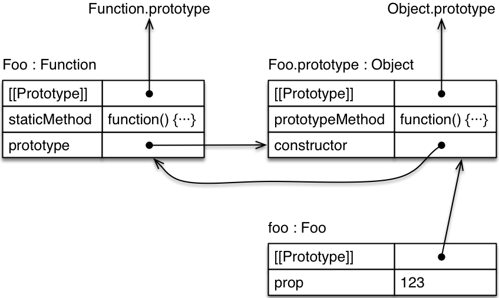

### 15. Classes

---
* 15.1. Overview
* 15.2. The essentials
  * 15.2.1. Base classes
  * 15.2.2. Inside the body of a class definition
  * 15.2.3. Subclassing
* 15.3. Private data for classes
  * 15.3.1. Private data via constructor environments
  * 15.3.2. Private data via a naming convention
  * 15.3.3. Private data via WeakMaps
  * 15.3.4. Private data via symbols
  * 15.3.5. Further reading
* 15.4. Simple mixins
* 15.5. The details of classes
  * 15.5.1. Various checks
  * 15.5.2. Attributes of properties
  * 15.5.3. Classes have inner names
* 15.6. The details of subclassing
  * 15.6.1. Prototype chains
  * 15.6.2. Allocating and initializing instances
  * 15.6.3. Why can’t you subclass built-in constructors in ES5?
  * 15.6.4. Referring to superproperties in methods
* 15.7. The species pattern
  * 15.7.1. Helper methods for examples
  * 15.7.2. The standard species pattern
  * 15.7.3. The species pattern for Arrays
  * 15.7.4. The species pattern in static methods
  * 15.7.5. Overriding the default species in subclasses
* 15.8. The pros and cons of classes
  * 15.8.1. Complaint: ES6 classes obscure the true nature of JavaScript inheritance
  * 15.8.2. Complaint: Classes provide only single inheritance
  * 15.8.3. Complaint: Classes lock you in, due to mandatory new
* 15.9. FAQ: classes
  * 15.9.1. Why can’t classes be function-called?
  * 15.9.2. How do I instantiate a class, given an Array of arguments?
* 15.10. What is next for classes?
* 15.11. Further reading

---

### 15.1 Overview

A class and a subclass:

          class Point {
              constructor(x, y) {
                  this.x = x;
                  this.y = y;
              }
              toString() {
                  return `(${this.x}, ${this.y})`;
              }
          }

          class ColorPoint extends Point {
              constructor(x, y, color) {
                  super(x, y);
                  this.color = color;
              }
              toString() {
                  return super.toString() + ' in ' + this.color;
              }
          }

Using the classes:

        > const cp = new ColorPoint(25, 8, 'green');

        > cp.toString();
        '(25, 8) in green'

        > cp instanceof ColorPoint
        true
        > cp instanceof Point
        true

Under the hood, ES6 classes are not something that is radically new: They mainly provide more convenient syntax to create old-school constructor functions. You can see that if you use typeof:

        > typeof Point
        'function'

### 15.2 The essentials

### 15.2.1 Base classes

A class is defined like this in ECMAScript 6:

          class Point {
              constructor(x, y) {
                  this.x = x;
                  this.y = y;
              }
              toString() {
                  return `(${this.x}, ${this.y})`;
              }
          }

You use this class just like an ES5 constructor function:

          > var p = new Point(25, 8);
          > p.toString()
          '(25, 8)'

In fact, the result of a class definition is a function:

          > typeof Point
          'function'

However, you can only invoke a class via new, not via a function call (the rationale behind this is explained later):

        > Point()
        TypeError: Classes can’t be function-called

In the spec, function-calling classes is prevented in the internal method [[Call]] of function objects.

### 15.2.1.1 No separators between members of class definitions

There is no separating punctuation between the members of a class definition.

For example, the members of an object literal are separated by commas, which are illegal at the top levels of class definitions. Semicolons are allowed, but ignored:

class MyClass {
    foo() {}
    ; // OK, ignored
    , // SyntaxError
    bar() {}
}
Semicolons are allowed in preparation for future syntax which may include semicolon-terminated members. Commas are forbidden to emphasize that class definitions are different from object literals.

不能使用逗号 分号可以但是省略

###15.2.1.2 Class declarations are not hoisted
### 类声明不会预解析

Function declarations are hoisted: When entering a scope, the functions that are declared in it are immediately available – independently of where the declarations happen. That means that you can call a function that is declared later:

          foo(); // works, because `foo` is hoisted

          function foo() {}

In contrast, class declarations are not hoisted. Therefore, a class only exists after execution reached its definition and it was evaluated. Accessing it beforehand leads to a ReferenceError:

          new Foo(); // ReferenceError

          class Foo {}

The reason for this limitation is that classes can have an extends clause whose value is an arbitrary expression. That expression must be evaluated in the proper “location”, its evaluation can’t be hoisted.

Not having hoisting is less limiting than you may think.

For example, a function that comes before a class declaration can still refer to that class, but you have to wait until the class declaration has been evaluated before you can call the function.

          function functionThatUsesBar() {
              new Bar();
          }

          functionThatUsesBar(); // ReferenceError

          class Bar {}
          functionThatUsesBar(); // OK

### 15.2.1.3 Class expressions
### 类表达式

Similarly to functions, there are two kinds of class definitions, two ways to define a class: class declarations and class expressions.

Similarly to function expressions, class expressions can be anonymous:

              const MyClass = class {
                  ···
              };
              const inst = new MyClass();

Also similarly to function expressions, class expressions can have names that are only visible inside them:

              const MyClass = class Me {
                  getClassName() {
                      return Me.name;
                  }
              };

              const inst = new MyClass();

              console.log(inst.getClassName()); // Me

              console.log(Me.name); // ReferenceError: Me is not defined

The last two lines demonstrate that Me does not become a variable outside of the class, but can be used inside it.

### 15.2.2 Inside the body of a class definition

A class body can only contain methods, but not data properties. Prototypes having data properties is generally considered an anti-pattern, so this just enforces a best practice.

### 15.2.2.1 constructor, static methods, prototype methods

Let’s examine three kinds of methods that you often find in class definitions.

          class Foo {
              constructor(prop) {
                  this.prop = prop;
              }
              static staticMethod() {
                  return 'classy';
              }
              prototypeMethod() {
                  return 'prototypical';
              }
          }
          const foo = new Foo(123);

The object diagram for this class declaration looks as follows. Tip for understanding it: [[Prototype]] is an inheritance relationship between objects, while prototype is a normal property whose value is an object.

The property prototype is only special w.r.t. the new operator using its value as the prototype for instances it creates.

