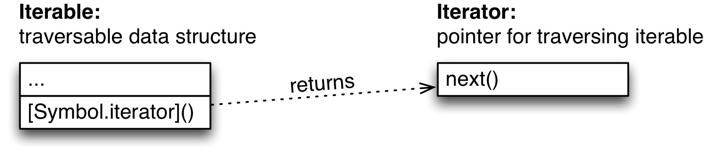

### 21. Iterables and iterators

---
* 21.1. Overview
  * 21.1.1. Iterable values
  * 21.1.2. Constructs supporting iteration
* 21.2. Iterability
* 21.3. Iterable data sources
  * 21.3.1. Arrays
  * 21.3.2. Strings
  * 21.3.3. Maps
  * 21.3.4. Sets
  * 21.3.5. arguments
  * 21.3.6. DOM data structures
  * 21.3.7. Iterable computed data
  * 21.3.8. Plain objects are not iterable
* 21.4. Iterating language constructs
  * 21.4.1. Destructuring via an Array pattern
  * 21.4.2. The for-of loop
  * 21.4.3. Array.from()
  * 21.4.4. The spread operator (...)
  * 21.4.5. Maps and Sets
  * 21.4.6. Promises
  * 21.4.7. yield*
* 21.5. Implementing iterables
  * 21.5.1. Iterators that are iterable
  * 21.5.2. Optional iterator methods: return() and throw()
* 21.6. More examples of iterables
  * 21.6.1. Tool functions that return iterables
  * 21.6.2. Combinators for iterables
  * 21.6.3. Infinite iterables
* 21.7. FAQ: iterables and iterators
  * 21.7.1. Isn’t the iteration protocol slow?
  * 21.7.2. Can I reuse the same object several times?
  * 21.7.3. Why doesn’t ECMAScript 6 have iterable combinators?
  * 21.7.4. Aren’t iterables difficult to implement?
* 21.8. The ECMAScript 6 iteration protocol in depth
  * 21.8.1. Iteration
  * 21.8.2. Closing iterators
  * 21.8.3. Checklist

---

### 21.1 Overview

ES6 introduces a new mechanism for traversing data: iteration.

ES6有新迭代数据机制

Two concepts are central to iteration:

有两个观点是迭代的核心

* An iterable is a data structure that wants to make its elements accessible to the public. It does so by implementing a method whose key is Symbol.iterator. That method is a factory for iterators.

对象如果有Symbol.iterator属性是可迭代

* An iterator is a pointer for traversing the elements of a data structure (think cursors in databases).

可迭代是游标对于数据结构遍历元素

Expressed as interfaces in TypeScript notation, these roles look like this:

          interface Iterable {
              [Symbol.iterator]() : Iterator;
          }
          interface Iterator {
              next() : IteratorResult;
          }
          interface IteratorResult {
              value: any;
              done: boolean;
          }

### 21.1.1 Iterable values

The following values are iterable:

1. Arrays
2. Strings
3. Maps
4. Sets
5. DOM data structures (work in progress)

Plain objects are not iterable (why is explained in [a dedicated section](http://exploringjs.com/es6/ch_iteration.html#sec_plain-objects-not-iterable)).

### 21.1.2 Constructs supporting iteration

Language constructs that access data via iteration:

* Destructuring via an Array pattern:

        const [a,b] = new Set(['a', 'b', 'c']);

* for-of loop:

        for (const x of ['a', 'b', 'c']) {
            console.log(x);
        }

* Array.from():

        const arr = Array.from(new Set(['a', 'b', 'c']));

* Spread operator (...):

        const arr = [...new Set(['a', 'b', 'c'])];

* Constructors of Maps and Sets:

        const map = new Map([[false, 'no'], [true, 'yes']]);
        const set = new Set(['a', 'b', 'c']);

* Promise.all(), Promise.race():

        Promise.all(iterableOverPromises).then(···);
        Promise.race(iterableOverPromises).then(···);

* yield*:

        yield* anIterable;

### 21.2 Iterability
### 可迭代性

The idea of iterability is as follows.

* Data consumers:

JavaScript has language constructs that consume data.

For example, for-of loops over values and the spread operator (...) inserts values into Arrays or function calls.

for-of spread operator (...)

* Data sources:

The data consumers could get their values from a variety of sources.

For example, you may want to iterate over the elements of an Array, the key-value entries in a Map or the characters of a string.

It’s not practical for every consumer to support all sources, especially because it should be possible to create new sources (e.g. via libraries). Therefore, ES6 introduces the interface Iterable. Data consumers use it, data sources implement it:

Given that JavaScript does not have interfaces, Iterable is more of a convention:

Source: A value is considered iterable if it has a method whose key is the symbol Symbol.iterator that returns a so-called iterator.

Symbol.iterator被称为可迭代

The iterator is an object that returns values via its method next(). We say: it iterates over the items (the content) of the iterable, one per method call.

Consumption: Data consumers use the iterator to retrieve the values they are consuming.

Let’s see what consumption looks like for an Array arr. First, you create an iterator via the method whose key is Symbol.iterator:

          > const arr = ['a', 'b', 'c'];
          > const iter = arr[Symbol.iterator]();

Then you call the iterator’s method next() repeatedly to retrieve the items “inside” the Array:

          > iter.next()
          { value: 'a', done: false }
          > iter.next()
          { value: 'b', done: false }
          > iter.next()
          { value: 'c', done: false }
          > iter.next()
          { value: undefined, done: true }

As you can see, next() returns each item wrapped in an object, as the value of the property value. The boolean property done indicates when the end of the sequence of items has been reached.

Iterable and iterators are part of a so-called protocol (interfaces plus rules for using them) for iteration.

A key characteristic of this protocol is that it is sequential: the iterator returns values one at a time.

That means that if an iterable data structure is non-linear (such as a tree), iteration will linearize it.

### 21.3 Iterable data sources

I’ll use the for-of loop to iterate over various kinds of iterable data.

### 21.3.1 Arrays

Arrays (and Typed Arrays) are iterables over their elements:

          for (const x of ['a', 'b']) {
              console.log(x);
          }
          // Output:
          // 'a'
          // 'b'

### 21.3.2 Strings

Strings are iterable, but they iterate over Unicode code points, each of which may comprise one or two JavaScript characters:

          for (const x of 'a\uD83D\uDC0A') {
              console.log(x);
          }
          // Output:
          // 'a'
          // '\uD83D\uDC0A' (crocodile emoji)

### 21.3.3 Maps

Maps are iterables over their entries. Each entry is encoded as a [key, value] pair, an Array with two elements. The entries are always iterated over deterministically, in the same order in which they were added to the map.

          const map = new Map().set('a', 1).set('b', 2);
          for (const pair of map) {
              console.log(pair);
          }
          // Output:
          // ['a', 1]
          // ['b', 2]

Note that WeakMaps are not iterable.

### 21.3.4 Sets

Sets are iterables over their elements (which are iterated over in the same order in which they were added to the Set).

          const set = new Set().add('a').add('b');
          for (const x of set) {
              console.log(x);
          }
          // Output:
          // 'a'
          // 'b'

Note that WeakSets are not iterable.

### 21.3.5 arguments

Even though the special variable arguments is more or less obsolete in ECMAScript 6 (due to rest parameters), it is iterable:

          function printArgs() {
              for (const x of arguments) {
                  console.log(x);
              }
          }
          printArgs('a', 'b');

          // Output:
          // 'a'
          // 'b'

### 21.3.6 DOM data structures

Most DOM data structures will eventually be iterable:

          for (const node of document.querySelectorAll('div')) {
              ···
          }

Note that implementing this functionality is work in progress. But it is relatively easy to do so, because the symbol Symbol.iterator can’t clash with existing property keys.

### 21.3.7 Iterable computed data

Not all iterable content does have to come from data structures, it could also be computed on the fly. For example, all major ES6 data structures (Arrays, Typed Arrays, Maps, Sets) have three methods that return iterable objects:

* entries() returns an iterable over entries encoded as [key, value] Arrays.

For Arrays, the values are the Array elements and the keys are their indices.

For Sets, each key and value are the same – the Set element.

* keys() returns an iterable over the keys of the entries.

* values() returns an iterable over the values of the entries.

Let’s see what that looks like. entries() gives you a nice way to get both Array elements and their indices:

          const arr = ['a', 'b', 'c'];
          for (const pair of arr.entries()) {
              console.log(pair);
          }
          // Output:
          // [0, 'a']
          // [1, 'b']
          // [2, 'c']

### 21.3.8 Plain objects are not iterable

Plain objects (as created by object literals) are not iterable:

空对象是通过对象字面量创建的是不可迭代

          for (const x of {}) { // TypeError
              console.log(x);
          }

Why aren’t objects iterable over properties, by default? The reasoning is as follows. There are two levels at which you can iterate in JavaScript:

1. The program level: iterating over properties means examining the structure of the program.

2. The data level: iterating over a data structure means examining the data managed by the program.

Making iteration over properties the default would mean mixing those levels, which would have two disadvantages:

* You can’t iterate over the properties of data structures.

* Once you iterate over the properties of an object, turning that object into a data structure would break your code.

If engines were to implement iterability via a method

Object.prototype[Symbol.iterator]() then there would be an additional caveat(警告): Objects created via Object.create(null) wouldn’t be iterable, because Object.prototype is not in their prototype chain.

It is important to remember that iterating over the properties of an object is mainly interesting if you use objects as Maps1. But we only do that in ES5 because we have no better alternative. In ECMAScript 6, we have the built-in data structure Map.

Plain objects (as created by object literals) are not iterable:

for (const x of {}) { // TypeError
    console.log(x);
}
Why aren’t objects iterable over properties, by default? The reasoning is as follows. There are two levels at which you can iterate in JavaScript:

The program level: iterating over properties means examining the structure of the program.
The data level: iterating over a data structure means examining the data managed by the program.
Making iteration over properties the default would mean mixing those levels, which would have two disadvantages:

You can’t iterate over the properties of data structures.
Once you iterate over the properties of an object, turning that object into a data structure would break your code.
If engines were to implement iterability via a method Object.prototype[Symbol.iterator]() then there would be an additional caveat: Objects created via Object.create(null) wouldn’t be iterable, because Object.prototype is not in their prototype chain.

It is important to remember that iterating over the properties of an object is mainly interesting if you use objects as Maps1. But we only do that in ES5 because we have no better alternative. In ECMAScript 6, we have the built-in data structure Map.

### 21.3.8.1 How to iterate over properties

The proper (and safe) way to iterate over prope[ties is via a tool function. For example, 【via objectEntries()](http://exploringjs.com/es6/ch_iteration.html#objectEntries), whose implementation is shown later (future ECMAScript versions may have something similar built in):

          const obj = { first: 'Jane', last: 'Doe' };

          for (const [key,value] of objectEntries(obj)) {
              console.log(`${key}: ${value}`);
          }

          // Output:
          // first: Jane
          // last: Doe

### 21.4 Iterating language constructs

The following ES6 language constructs make use of the iteration protocol:

* Destructuring via an Array pattern
* for-of loop
* Array.from()
* Spread operator (...)
* Constructors of Maps and Sets
* Promise.all(), Promise.race()
* yield*

### 21.4.1 Destructuring via an Array pattern
### 通过数组格式解构

Destructuring via Array patterns works for any iterable:

const set = new Set().add('a').add('b').add('c');

        const [x,y] = set;
            // x='a'; y='b'

        const [first, ...rest] = set;
            // first='a'; rest=['b','c'];

### 21.4.2 The for-of loop

for-of is a new loop in ECMAScript 6. It’s basic form looks like this:

        for (const x of iterable) {
            ···
        }

Note that the iterability of iterable is required, otherwise for-of can’t loop over a value. That means that non-iterable values must be converted to something iterable. For example, via Array.from().

### 21.4.3 Array.from()

Array.from() converts iterable and Array-like values to Arrays. It is also available for typed Arrays.

        > Array.from(new Map().set(false, 'no').set(true, 'yes'))
        [[false,'no'], [true,'yes']]
        > Array.from({ length: 2, 0: 'hello', 1: 'world' })
        ['hello', 'world']

For more information on Array.from(), consult the chapter on Arrays.

### 21.4.4 The spread operator (...)

The spread operator inserts the values of an iterable into an Array:

        > const arr = ['b', 'c'];
        > ['a', ...arr, 'd']
        ['a', 'b', 'c', 'd']

That means that it provides you with a compact way to convert any iterable to an Array:

         const arr = [...iterable];

The spread operator also turns an iterable into the arguments of a function, method or constructor call:

          > Math.max(...[-1, 8, 3])
          8

### 21.4.5 Maps and Sets

The constructor of a Map turns an iterable over [key, value] pairs into a Map:

          > const map = new Map([['uno', 'one'], ['dos', 'two']]);
          > map.get('uno')
          'one'
          > map.get('dos')
          'two'

The constructor of a Set turns an iterable over elements into a Set:

          > const set = new Set(['red', 'green', 'blue']);
          > set.has('red')
          true
          > set.has('yellow')
          false

The constructors of WeakMap and WeakSet work similarly. Furthermore, Maps and Sets are iterable themselves (WeakMaps and WeakSets aren’t), which means that you can use their constructors to clone them.

### 21.4.6 Promises

Promise.all() and Promise.race() accept iterables over Promises:

          Promise.all(iterableOverPromises).then(···);
          Promise.race(iterableOverPromises).then(···);

### 21.4.7 yield*

yield* is an operator that is only available inside generators. It yields all items iterated over by an iterable.

              function* yieldAllValuesOf(iterable) {
                  yield* iterable;
              }

The most important use case for yield* is to recursively call a generator (which produces something iterable).

### 21.5 Implementing iterables

In this section, I explain in detail how to implement iterables. Note that ES6 generators are usually much more convenient for this task than doing so “manually”.

The iteration protocol looks as follows.

