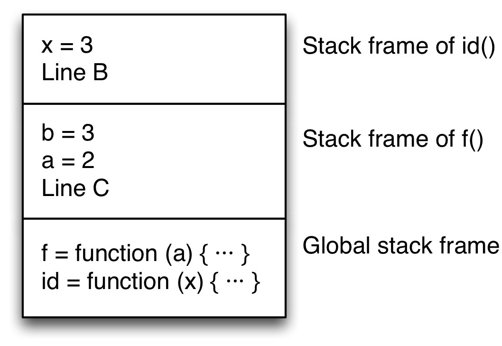
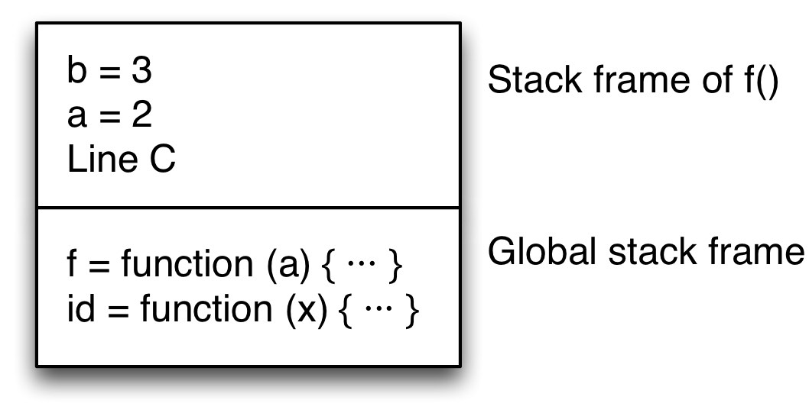
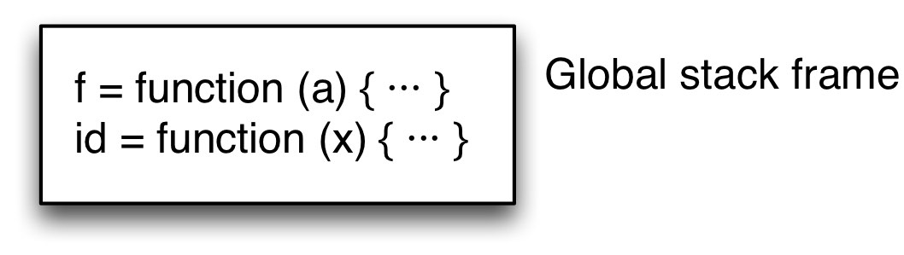
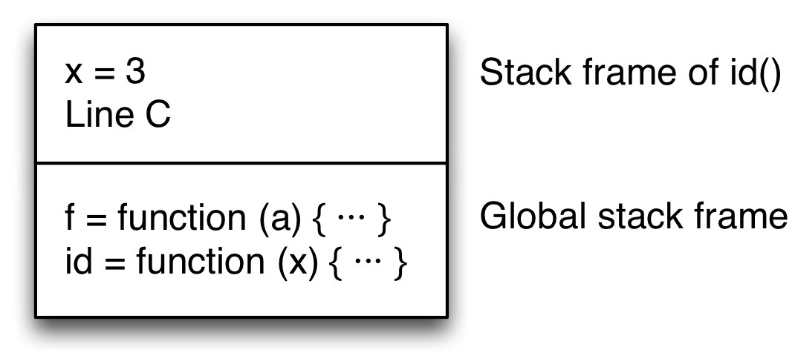

### 27. Tail call optimization

ECMAScript 6 offers tail call optimization, where you can make some function calls without growing the call stack. This chapter explains how that works and what benefits it brings.

---

* 27.1. What is tail call optimization?
  * 27.1.1. Normal execution
  * 27.1.2. Tail call optimization
* 27.2. Checking whether a function call is in a tail position
  * 27.2.1. Tail calls in expressions
  * 27.2.2. Tail calls in statements
  * 27.2.3. Tail call optimization can only be made in strict mode
  * 27.2.4. Pitfall: solo function calls are never in tail position
* 27.3. Tail-recursive functions
  * 27.3.1. Tail-recursive loops

---

### 27.1 What is tail call optimization?

Roughly, whenever the last thing a function does is to call another function then the latter does not need to return to its caller. As a consequence, no information needs to be stored on the call stack and the function call is more of a goto (a jump). This kind of call is named tail call; not growing the stack is named tail call optimization (TCO).

Let’s look at an example to better understand TCO. I’ll first explain how it is executed without TCO and then with TCO.

function id(x) {
    return x; // (A)
}
function f(a) {
    const b = a + 1;
    return id(b); // (B)
}
console.log(f(2)); // (C)

### 27.1.1 Normal execution

Let’s assume there is a JavaScript engine that manages function calls by storing local variables and return addresses on a stack. How would such an engine execute the code?

**Step 1.** Initially, there are only the global variables id and f on the stack.

The block of stack entries encodes the state (local variables, including parameters) of the current scope and is called a stack frame.

**Step 2.** In line C, f() is called: First, the location to return to is saved on the stack. Then f’s parameters are allocated and execution jumps to its body. The stack now looks as follows.

There are now two frames on the stack: One for the global scope (bottom) and one for f() (top). f’s stack frame includes the return address, line C.

**Step 3.** id() is called in line B. Again, a stack frame is created that contains the return address and id’s parameter.

**Step 4.** In line A, the result x is returned. id’s stack frame is removed and execution jumps to the return address, line B. (There are several ways in which returning a value could be handled. Two common solutions are to leave the result on a stack or to hand it over in a register. I ignore this part of execution here.)

The stack now looks as follows:

**Step 5.** In line B, the value that was returned by id is returned to f’s caller. Again, the topmost stack frame is removed and execution jumps to the return address, line C.

Step 6. Line C receives the value 3 and logs it.

### 27.1.2 Tail call optimization

          function id(x) {
              return x; // (A)
          }
          function f(a) {
              const b = a + 1;
              return id(b); // (B)
          }
          console.log(f(2)); // (C)

If you look at the previous section then there is one step that is unnecessary – step 5. All that happens in line B is that the value returned by id() is passed on to line C. Ideally, id() could do that itself and the intermediate step could be skipped.

We can make this happen by implementing the function call in line B differently. Before the call happens, the stack looks as follows.

If we examine the call we see that it is the very last action in f(). Once id() is done, the only remaining action performed by f() is to pass id’s result to f’s caller. Therefore, f’s variables are not needed, anymore and its stack frame can be removed before making the call. The return address given to id() is f’s return address, line C. During the execution of id(), the stack looks like this:

Then id() returns the value 3. You could say that it returns that value for f(), because it transports it to f’s caller, line C.

Let’s review: The function call in line B is a tail call. Such a call can be done with zero stack growth. To find out whether a function call is a tail call, we must check whether it is in a tail position (i.e., the last action in a function). How that is done is explained in the next section.
