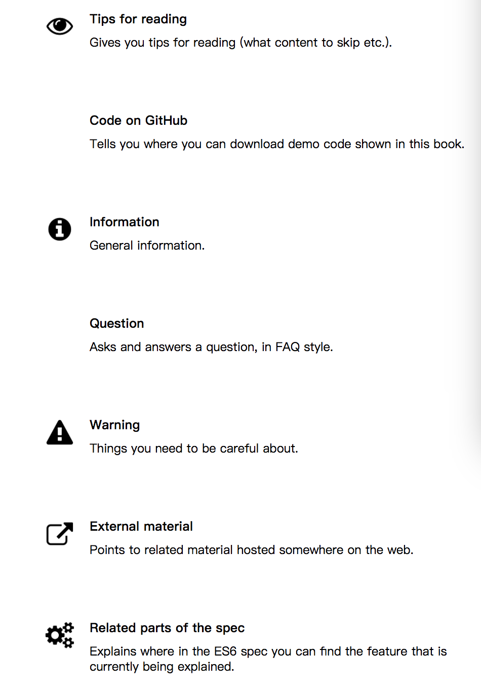

## Exploring ES6 chinese

  第一次翻译 坚持到底

---

### Table of Contents
1. **[What you need to know about this book读书须知](#What-you-need-to-know-about-this-book)**

   * **[Audience: JavaScript programmers](#Audience-JavaScript-programmers)**
   * **[Why should I read th  book?](#Why-should-I-read-this-book)**
   * **[How to read this book](#How-to-read-this-book)**
   * **[Sources of this book](#Sources-of-this-book)**
   * **[Glossary](#Glossary)**
   * **[Conventions](#Conventions)**
   * **[Demo code on GitHub](#Demo-code-on-GitHub)**
   * **[Sidebars](#Sidebars)**
   * **[Footnotes](#Footnotes)**

2. **[Foreword 序](#Foreword)**
3. **[Preface 前言](#Preface)**
4. **[Acknowledgements 致谢](#Acknowledgements)**
5. **[About the author 关于作者](#About-the-author)**

---
### What you need to know about this book
This book is about ECMAScript 6 (whose official name is ECMAScript 2015), a new version of JavaScript.  

本书主要介绍ECMAScript 6(官方称为ECMAScript 2015)是JavaScript的新版本  

### Audience: JavaScript programmers
In order to understand this book, you should already know JavaScript. If you don’t: my other book [“Speaking JavaScript”](http://speakingjs.com/) is free online and teaches programmers all of JavaScript (up to and including ECMAScript 5).  

为了更好学习本书，您最好是具有JavaScript基础。如果你还不具备JavaScript基础，可以先读我的《Speaking JavaScript》这本书--学习javascript基础知识并包含ECMAScript 5。  

### Why should I read this book?

* **You decide how deep to go:** This book covers ECMAScript 6 in depth, but is structured so that you can also quickly get an overview if you want to.  

* **深度学习** 本书在深度上覆盖ECMAScript 6知识，你也可以大概的学习  

* **Not just “what”, also “why”:** This book not only tells you how ES6 works, it also tells you why it works the way it does.  

* **不仅知道是什么 更想知道为什么** 告诉ES6如何做 更告诉为何这么做？

* **Thoroughly researched:**  In order to make sense of ES6, I have consulted many sources:  
* **彻底的研究**  为了搞清ES6，我参考下面六个来源

  * The language specification (to which you’ll occasionally find pointers in this book)  
  * 语言规范 在本书你可以发现给出指引
  * The es-discuss mailing list
  * es-discuss邮件列表
  * The TC39 meeting notes
  * TC39会议记录
  * Scientific papers
  * 研究者论文
  * Documentation on features in other languages that inspired ES6 features
  * 其他语言文档上特色引起ES6特色
  * And more
  * 更多

### How to read this book
This book covers ES6 with three levels of detail:

  * **Quick start:** Begin with the chapter “Core ES6 features”. Additionally, almost every chapter starts with a section giving an overview of what’s in the chapter. The last chapter collects all of these overview sections in a single location.  

  * **速学:** 在ES6核心特色这章可以实现,同时几乎每一章的开始是本章的概述。

  * **Solid foundation:** Each chapter always starts with the essentials and then increasingly goes into details. The headings should give you a good idea of when to stop reading, but I also occasionally give tips in sidebars w.r.t. how important it is to know something.

  * **基础知识:** 每一章从本质开始渐渐渗透到细节。标题给出很好建议如果你不想读,但是我也出小提示在关于侧边栏,某一个细节的重要性

  * with regard to 的缩写，意思是“关于”.

  * **In-depth knowledge:** Read all of a chapter, including the in-depth parts.

  * **知识深度**

  Other things to know:
  其他需要知道的

  * **Recommendations:** I occasionally recommend simple rules. Those are meant as guidelines, to keep you safe without you having to know (or remember) all of the details. I tend to favor mainstream over elegance, because most code doesn’t exist in a vacuum. However, I’ll always give you enough information so that you can make up your own mind.
  * **推荐:** 我偶尔介绍简单规则,这些基本指导为了使您能够正确使用如果没有深入了解和记住这些规则的细节。我倾向于喜欢主流的代码胜于优雅代码。实际上代码是用来完成工作而不是艺术品。但是 我总是给你充足的知识以便于你实现自己的想法。

  * **Forum:** The “Exploring ES6” homepage [links to a forum](http://exploringjs.com/es6.html#forum) where you can discuss questions and ideas related to this book.  

  * **论坛** 在“Exploring ES6”首页给出论坛链接,你可以讨论问题或者涉及到本书的想法

  * **Errata (typos, errors, etc.):** [On the “Exploring ES6” homepage](http://exploringjs.com/es6.html#errata), there are links to a form for submitting errata and to a list with submitted errata.

  * **勘误表** 在“Exploring ES6”首页给出勘误表的链接,您可以提交勘误。

### Sources of this book
### 本书代码

I started writing this book long before there were implementations of ES6 features, which required quite a bit of research. Essential sources were:   

我开始写这本书很久以前有ES6功能的实现,这需要相当多的研究。主要来源如下：

  * [The es-discuss mailing list](https://mail.mozilla.org/listinfo/es-discuss)
  * [TC39 meeting notes](https://github.com/tc39/tc39-notes/)
  * [The ECMAScript language specification](http://www.ecma-international.org/ecma-262/6.0/)
  * [The old ECMAScript Harmony wiki](http://wiki.ecmascript.org/doku.php?id=harmony:harmony)
  * Scientific papers (e.g. the ones written about ES6 proxies) and other material on the web.
  * Asking around to fill remaining holes (the people who answered are acknowledged throughout the book)

### Glossary
### 词汇表

**Strict mode versus sloppy mode**
**严格模式与宽松模式**

ECMAScript 5 introduced language modes: Strict mode makes JavaScript a cleaner language by changing its semantics, performing more checks and throwing more exceptions. Consult Sect. [“Strict Mode”](http://speakingjs.com/es5/ch07.html#strict_mode) in “Speaking JavaScript” for more information. The legacy/default mode is called non-strict mode or sloppy mode.  

ECMAScript 5介绍两种模式：严格模式是JavaScript代码变干净语言通过改变语法. 性能更多检查和抛出更多意外。默认模式是款冬模式

Strict mode is switched on via the following line (which does nothing in ECMAScript versions before ES5):  

选择严格模式通过下面的一行代码：   

          'use strict';

If you put this line at the beginning of a file, all code in it is in strict mode. If you make this line the first line of a function, only that function is in strict mode.

如果你把这行代码放到一个文件开始则整个文件是严格模式,如果放在一个函数开始则这个函数是严格模式.

Using a directive to switch on strict mode is not very user friendly and was one of the reasons why strict mode was not nearly as popular in ES5 as it should be. However, ES6 modules and classes are implicitly in strict mode. Given that most ES6 code will live in modules, strict mode becomes the de-facto default for ES6.

使用指令选择严格模式不是很用户友好的原因:这也是严格模式在ES5不受欢迎.

模块和类默认是严格模式,绝大ES6代码运行在模块中,实际上严格模式是ES6默认模式.

de facto 实际上

de jure  法理上

### Protocol
The term protocol has various meanings in computing. In the context of programming languages and API design, I’m using it as follows:

协议这个词有不同意思.在编程语言和API设计的环境中,我的理解如下面:

> A protocol defines interfaces (signatures for methods and/or functions) and rules for using them.

> 协议定义了接口(方法和/或函数签名)和规则的使用它们。

The idea is to specify how a service is to be performed. Then anyone can perform the service and anyone can request it and they are guaranteed to work together well.

这个想法是为了介绍服务是如何被执行。任何人都可以执行服务,任何人都可以请求他们保证合作顺利。

Note that the definition given here is different from viewing a protocol as an interface (as, for example, Objective C does), because this definition includes rules.

注意,这里给出的定义不同于查看协议作为一个接口(例如,Objective - C),因为这个定义包括规则。

### Receiver (of a method call)

Given a method call obj.m(···), obj is the receiver of the method call and accessible via this inside the method.  

调用一个方法通过call obj.m(···),obj是调用方法接受者,并且访问内部方法

### Signature of a function (or a method)

The (type) signature of a function describes how the function is to be called, what its inputs and its output are. I’m using the syntax established by Microsoft TypeScript and Facebook Flow in this book. An example of a signature:  

函数类型描述如何函数如何被调用 并且说明输入项和输出项 我用语法建立在微软的TypeScript和脸谱的Flow在这本书。下面列子是

        parseInt(string : string, radix? : number) : number  
        parseInt(字符串参数,可选参数是数字) 得到一个数字

You can see that parseInt() expects a string and a number and returns a number. If the type of a parameter is clear, I often omit the type annotation.

我经常忘记这个注解

### Internal slots
### 内部接口

The ES6 language specification uses internal slots to store internal data. In the spec, internal slots are accessed as if they were properties whose names are in square brackets:

在ES6中添加内部方法用来存储内部数据,在规定中,内部方法可以通过属性用方括号的方式来访问

        O.[[GetPrototypeOf]]()

Two things differentiate them from properties:

  * They are not read via “get” operations and written via “set” operations.

  不能set方式设定 不能通过set进行设定

  * They are only known to the spec and not accessible from JavaScript. For example: the link between an object and its prototype is the internal slot [[Prototype]]. The value of that slot cannot be read directly via JavaScript, but you can use Object.getPrototypeOf() to do so.

How exactly internal slots are stored is left unspecified. Some may not even exist in actual JavaScript implementations.

很多内部方法并没有准确的说明,甚至有一些在实际的javascipt中并没有实现。

### Bindings and environments
### 绑定和环境

The ECMAScript spec uses a data structure called environment to store the variables of a scope. An environment is basically a dictionary that maps variable names to values. A binding is an entry in an environment, storage space for a variable.

在ECMAScript规范中使用数据结构存储变量的作用域被称为执行环境,一个执行环境是一个变量名称与变量值映射的字典, 一个绑定就是对字典一个访问,一个存储空间对应一个变量

### Destructive operations
### 破坏性操作

Destructive operations (methods, functions) modify their parameters or their receivers. For example, push() modifies its receiver arr:

破坏性操作修改传入参数或接收者.

        > const arr = ['a', 'b'];
        > arr.push('c')
        3
        > arr
        [ 'a', 'b', 'c' ]
        In contrast, concat() creates a new Array and does not change its receiver arr:

        > const arr = ['a', 'b'];
        > arr.concat(['c'])
        [ 'a', 'b', 'c' ]
        > arr
        [ 'a', 'b' ]

### Conventions

### Documenting classes

The API of a class C is usually documented as follows:

* C constructor
* Static C methods
* C.prototype methods

### Capitalization
### 大写

In English, I capitalize JavaScript terms as follows:

在英语中 我大写JavaScript的术语如下:

   * The names of primitive entities are not capitalized: a boolean value, a number value, a symbol, a string. One reason why I’m doing this is because TypeScript and Flow distinguish:

   * 原始体不大写 例如 布尔值 数字值 符号字符串 原因是TypeScript and Flow区别

   * The type String: its members are objects, instances of String.

   * The type string: its members are primitive values, strings.

   * The data structure Map is capitalized. Rationale: distinguish from the Array method map().

   * Map数据类型大写 基本原理是区分map方法

   * The data structure Set is capitalized. Rationale: distinguish from the verb set.

   * Set数据类型大写 基本原理是区分set方法

   * Array and Promise are capitalized. Rationale: easy to confuse with English words.

   * 数组和Promise也大写 基本原理是为了不与英语单词混淆

### Demo code on GitHub

Several repositories on GitHub contain code shown in this book:

  * **[async-examples](https://github.com/rauschma/async-examples)**
  * **[babel-on-node](https://github.com/rauschma/babel-on-node)**
  * **[demo_promise](https://github.com/rauschma/demo_promise)**
  * **[generator-examples](https://github.com/rauschma/generator-examples)**
  * **[node-es6-demo](https://github.com/rauschma/node-es6-demo)**
  * **[promise-examples](https://github.com/rauschma/promise-examples)**
  * **[webpack-es6-demo](https://github.com/rauschma/webpack-es6-demo)**

### Sidebars

Sidebars are boxes of text marked with icons. They complement the normal content.
侧栏是标记文字和图表组成

