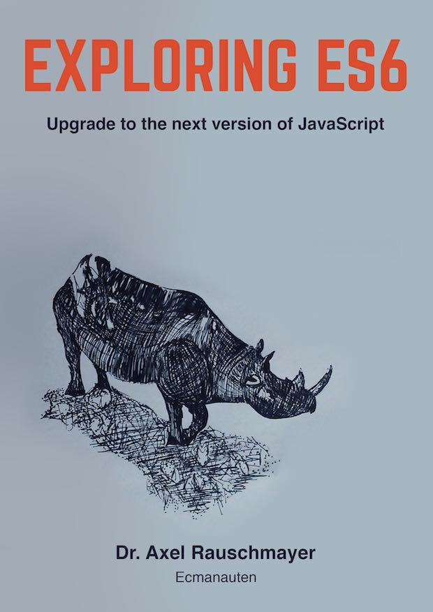

## Exploring ES6 chinese

  第一次翻译 坚持到底

---

### Table of Contents
1. **[What you need to know about this book读书须知](#What-you-need-to-know-about-this-book)**

   * **[Audience: JavaScript programmers](#Audience-JavaScript-programmers)**
   * **[Why should I read th  book?](#Why-should-I-read-this-book)**
   * **[How to read this book](#How-to-read-this-book)**
   * **[Sources of this book](#Sources-of-this-book)**
   * **[Glossary](#Glossary)**
   * **[Conventions](#Conventions)**
   * **[Demo code on GitHub](#Demo-code-on-GitHub)**
   * **[Sidebars](#Sidebars)**
   * **[Footnotes](#Footnotes)**

2. **[Foreword 序](#Foreword)**
3. **[Preface 前言](#Preface)**
4. **[Acknowledgements 致谢](#Acknowledgements)**
5. **[About the author 关于作者](#About-the-author)**

---
### What you need to know about this book
This book is about ECMAScript 6 (whose official name is ECMAScript 2015), a new version of JavaScript.  

本书主要介绍ECMAScript 6(官方称为ECMAScript 2015)是JavaScript的新版本  

### Audience: JavaScript programmers
In order to understand this book, you should already know JavaScript. If you don’t: my other book [“Speaking JavaScript”][http://speakingjs.com/] is free online and teaches programmers all of JavaScript (up to and including ECMAScript 5).  

为了更好学习本书，您最好是具有JavaScript基础。如果你还不具备JavaScript基础，可以先读我的《Speaking JavaScript》这本书--学习javascript基础知识并包含ECMAScript 5。
